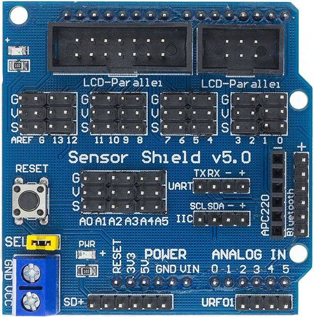
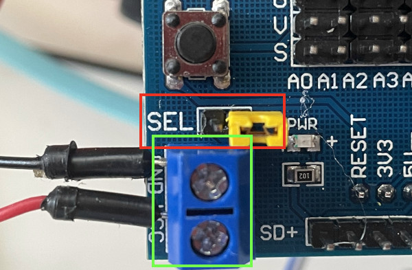
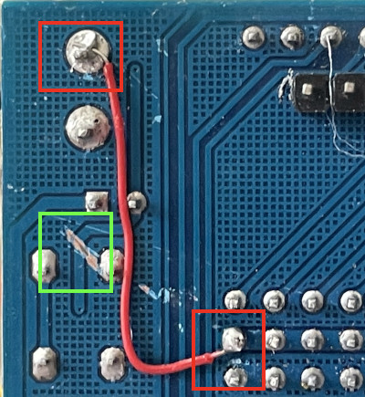

# uno-sensor-shield
Schematics of Arduino UNO sensor shield

# Introduction

[Arduino UNO Sensor Shield V5](https://www.amazon.com/HiLetgo-Upgraded-Arduino-Sensor-Expansion/dp/B01MXRXCAW) is an unofficial shield designed for [Arduino UNO](https://store-usa.arduino.cc/products/arduino-uno-rev3).
It is quite handy for interfacing with **5.0V** peripherals such as potentiometers, proximity sensors, etc.

I could not find a schematics so made this by inspecting the shield that I bought.

# Hardware Caveats
## Not enough current for servos / motors
By default all digital IO ports and analog IO ports draw current from `5V` and `GND` of the power pins.
While this works with most sensors, the power regulator of UNO may not be able to provide enough currents to drive servos and/or motors.

The digital IO ports can be configured to draw current from an external **5.0V** power supply; see photo below:
1. **disconnect** the `SEL` jumper (highlighted by red box).
2. connect the power terminal to the external **5.0V** power supply (highlighted by green box).

Unfortunately the analog IO ports are hard-wired to the `5V` pin.
This can be mitigated with some rework; see the next section for details.

## Reworking for 3.3V boards
Some board (e.g. [nRF52840 DK](https://www.nordicsemi.com/Products/Development-hardware/nrf52840-dk)) are UNO compatible, but operate at 3.3V instead of 5.0V.
Connecting sensors to the shield may fry those 3.3V MCUs.

This can be mitigated by reworking the board; see photo below:
1. wire `VCC` o the power terminal to the analog IO ports (highlighted by red boxes).
2. cut the trace on the back of the board (highlighted by green box).
3. connect the power terminal to the external **3.3V** power supply.

Note with this rework, the peripherals will operate at different voltages:
* Analog IO ports: 3.3V
* Digital IO ports: 3.3V
* SD Card: 5.0V
* Ultrasound: 5.0V
* I2C (aka IIC): 3.3V
* Serial (aka UART): 3.3V
* 12864 LCD (parallel and serial): 3.3V
* Bluetooth: 3.3V
* APC220 wireless module: 3.3V

# Contributing
Feel free to start issues and/or create merge requests.

To edit the schematics, import [sensor-shield-v5.json](sensor-shield-v5.json) to [easyEDA](https://easyeda.com/).

Please remember to also update the [pdf](sensor-shield-v5.pdf) version.
